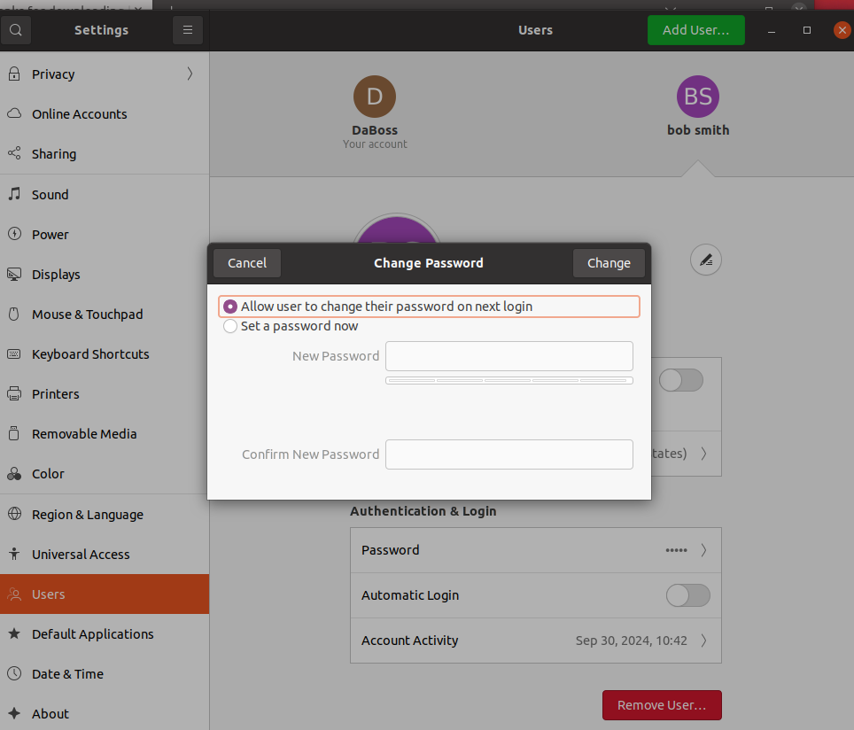
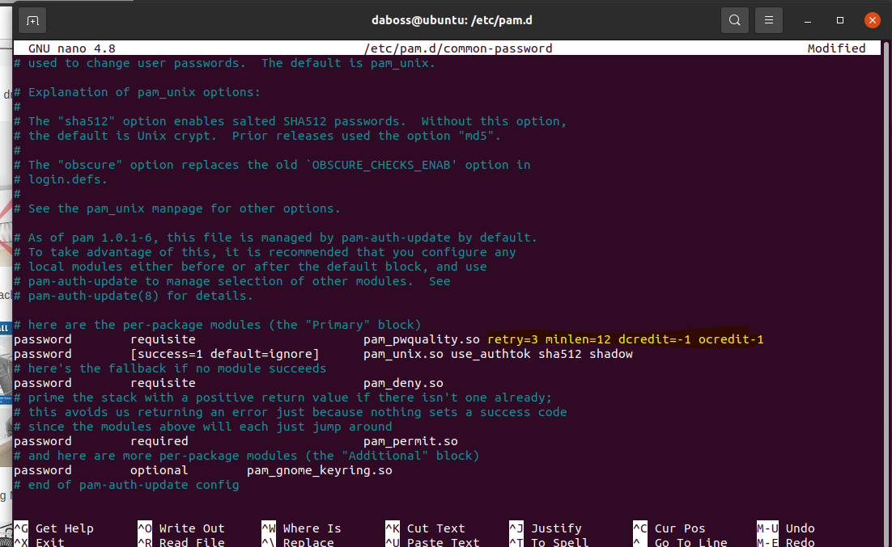
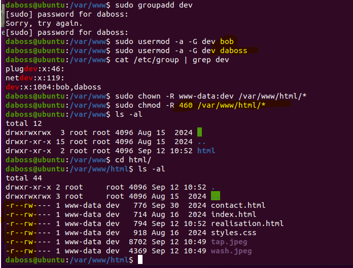

# Travail 2 par *Diallo Mamadou Bobo* *groupe: 1050*

## Attaque (exploit).

Voici les étapes détaillées pour pouvoir modifier le courriel / téléphone sur la page demandée:

- Test des ports ouverts de l'adresse IP (http://192.168.220.10/) avec Nmap (scan intensif).
- Les ports 22 (SSH) et 80 (HTTP) sont ouverts donc on peut utiliser ssh pour se connecter à la machine de notre victime. 
##

- Test de la connexion par ssh (le nom d'utilisateur  bob, on la trouver par déduction, son prenom c'est bob).
- Le mot de passe peut être déduit par  les anciens mots de passe: "Jane2001!" et "Patricia2011!" et ses informations (3 filles : Jane (5 juin 2001), Patricia (9 novembre 2011) et Sophie (10 décembre 2014)).
- Sophie2014!
##

##

- Une fois connecté, il faut chercher l'emplacement du fichier HTML du site web.
- Il se trouve dans /var/www/HTML. La commande cd /var/www/HTML ( CD + l'emplacement pour t'y rendre) et après ( ls -al ) pour afficher les fichiers et dossiers.
##

## 1re modification: changer le numéro de téléphone.
- On utilise la commande: nano (le nom du fichier): [nano contact.html]  pour accéder et changer le fichier ( Par téléphone : on y ajoute le numéro demandé).
##

## 2e modification: le lien mailto.

- On est déjà dans le fichier de contact, donc on doit juste changer le lien à l'emplacement "Par courriel" par "ouch.hacked@cem.ca"
- Une fois le contact changer, on fait : ctrl+X pour sortir et enregistrer le fichier HTML.
##

## 3e modification: supprimer les images de réalisation.

- On fait la commande nano realisation.html pour accéder au fichier et supprimer les images demandées.
- À l'emplacement < img src =""> on supprime le contenu entre les " " et les images seront supprimés.
- Une fois changé, on fait : ctrl+X pour sortir et enregistrer le fichier HTML.
##
 

## Les résultats des modifications.

- En rechargeant la page, on constate que le numéro de téléphone a été modifié, les images supprimées et le courriel sont changés.
##

##

##

## Correctif 1
## Changer le mot de passe et avoir des mots de passe plus compliqués.

- Comme premier correctif, on peut déjà avoir un mot de passe plus complexe et pas aussi facile à deviner comme celui de notre victime. Cela  aura pour effet d'empêcher l'étape 3 de l'exploit, la connexion à la machine avec l'utilisateur et le mot de passe.
- Il faut que le mot de passe soit difficile à connaitre pour les autres et facile pour soi. Le plus simple est d'utiliser une phrase de passe (un mot de passe fait avec une phrase qui est facile pour soi de se rappeler.)
- Donc, pour changer le mot de passe, on doit aller dans Settings (Paramètres), ensuite Users (Utilisateurs), on choisit l'utilisateur Bob Smith et l’on choisit "Allow user to change their password on next login".
- Pour etre sur que Bob utilise un mot de passe robuste on peut installer un logiciel comme PAM (privilege Access Management) qui permet de s'assurer que les mots de passe créés respectent certains critères de sécurité.
- La commande sudo apt install libpam-pwquality pour installer. Faire la commande sudo nano /etc/pam.d/common-password pour changer les critères de mot de passe. Ensuite la commande : (password    requisite     pam_pwquality.so retry=3 minlen=8 dcredit=-1 ocredit=-1
password    [success=1 default=ignore] pam_unix.so use_authtok sha512 shadow) pour les critères. ctrl+X pour enregistrer et quitter.

##
## Correctif 2 
## Fermer les ports non utilisés [22(ssh),80 (http)].

- Comme second correctif, on peut mettre en place des règles de pare-feu qui empêche le trafic sur les ports qui sont ouverts, mais que l'on ne se sert pas comme les ports 22 (SSH) et 80 (HTTP). Ce correctif aura comme effet de bloquer la deuxième étape de l'exploit donc le reste de l'exploit ne peut pas fonctionner.
- Il faut d'abord faire la commande (sudo netstat -pantu) pour voir quel port est  ouvert et quel protocole écoute sur quel port.
- Ensuite, on active le pare-feu avec la commande : sudo ufw enable
- Après, on désactive le port avec la commande : sudo ufw deny 22
- Ensuite, on fait la commande sudo ufw reload pour changer l'état du parefeu pour que l'état actuel puisse être enregistré.
- Pour finir, on s'assure que le port est bien fermé avec la commande : sudo ufw status verbose.

##
## Correctif 3
## Changer les permissions des fichiers de configuration du site.

- Pour le dernier correctif, il faut changer les permissions des fichiers de configurations du site et aussi du dossier où sont situés les fichiers. Ce correctif intervient dans la 4e étape et empêche  n'importe qui de modifier le site web.
- Première étape, créer un groupe de permissions pour bob et daboss avec la commande : sudo groupadd dev et sudo usermod -a -G dev bob /daboss. Après, changer le propriétaire du dossier par www-data (apache) et lui donner les bonnes permissions: sudo chown -R www-data:dev /var/www/html/*
sudo chmod -R 460 /var/www/html/* (-R = récursif donc s'applique au futur dossier ou fichier créer). Pour finir, on fait ls -al pour vérifier que les permissions ont été bien appliquées.

