# Travail 2 par *Diallo Mamadou Bobo* *groupe: 1050*

## Attaque (exploit).

Voici les étapes détaillées pour pouvoir modifier le courriel / téléphone sur la page demandée:

- Test des ports ouverts de l'addresse IP (http://192.168.220.10/) avec Nmap (scan intensif).
- Les port 22 (ssh) et 80 (http) sont ouverts donc on peut utiliser ssh pour se connecter à la machine de notre victime. 
##
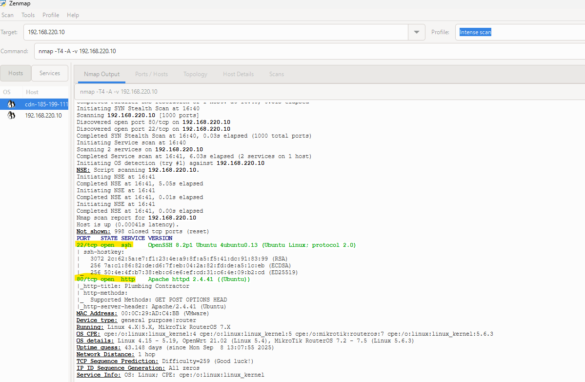

- Test de la connection par ssh (le nom d'utilisateur c'est bob, on la trouver par déduction, son prenom c'est bob).
- Le mot de passe peut être déduis par  les anciens mots de passe: "Jane2001!" et "Patricia2011!" et ses informations (3 filles : Jane (5 juin 2001), Patricia (9 novembre 2011) et Sophie (10 décembre 2014)).
- Sophie2014!
##
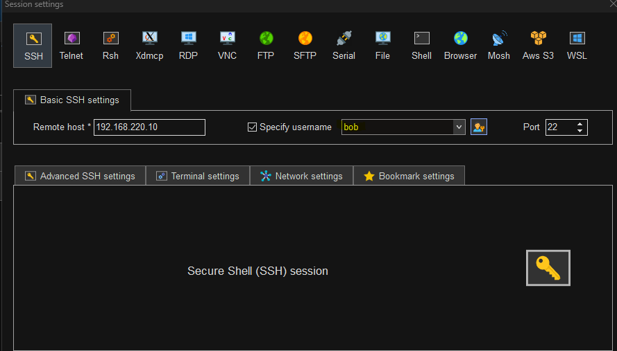
##
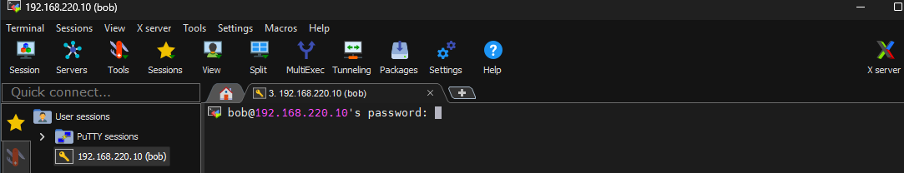

- Une fois connecter, il faut chercher l'emplacement du fichier html du site web.
- Il se trouve dans /var/www/html. La commande cd /var/www/html ( cd + l'emplacement pour t'y rendre) et après ( ls -al ) pour afficher les fichiers et dossiers.
##
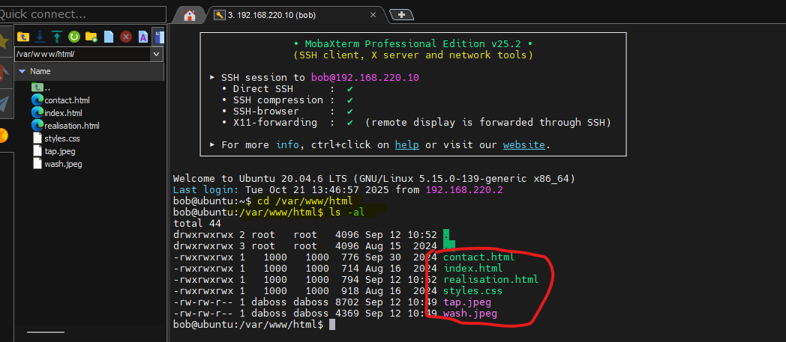

## 1ère modification: changer le numéro de téléphone.
- On utilise la commande: nano (le nom du fichier): [nano contact.html]  pour acceder et changer le fichier (Par téléphone : on y ajoute le numero demandé).
##
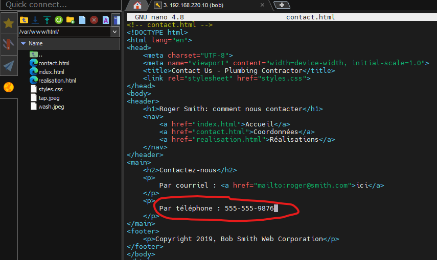

## 2 ème modification: le lien mailto.

- On est dejà dans le fichier de contact, donc on doit juste changer le lien à l'emplacement "Par courriel" par "ouch.hacked@cem.ca"
- Une fois le contact changer, on fait : ctrl+X pour sortir et enregistrer le fichier html.
##
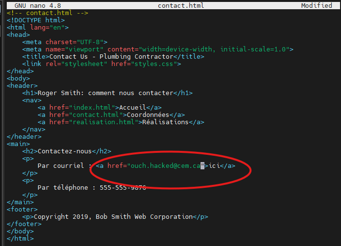

## 3 ème modification: supprimmer les images de réalisation.

- On fait la commande nano realisation.html pour acceder au fichier et supprimer les images demandées.
- À l'eplacement < img src =""> on supprime le contenu entre les " " et les images seront supprimer.
- Une fois changer, on fait : ctrl+X pour sortir et enregistrer le fichier html.
##
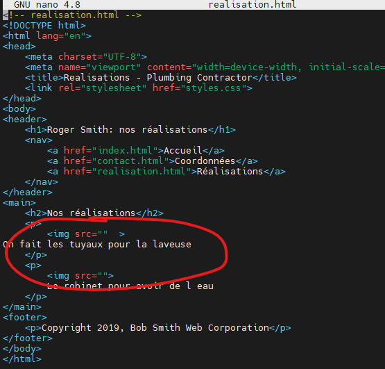 

## Les résultats des modifications.

- En rechargeant la page, on constate que le numéro de téléphone a été modifié, les images supprimées et le courriel changé.
##
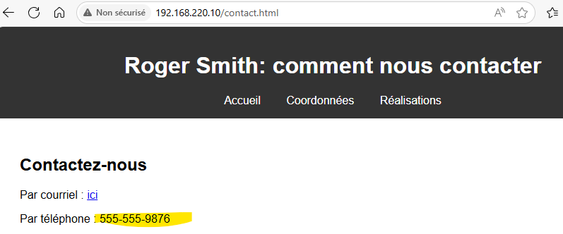

##
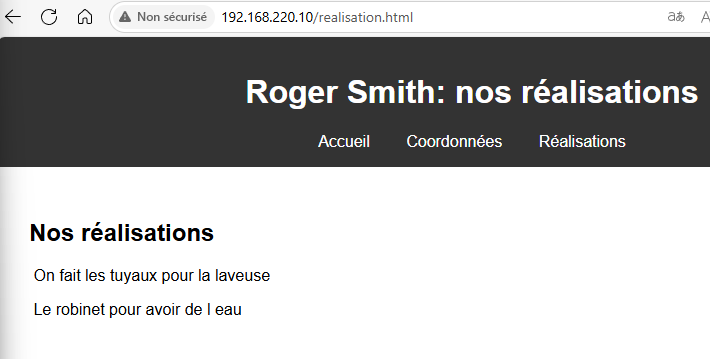

##
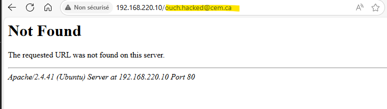

## Correctif 1
## Avoir des mots de passes plus compliquer/changer.

- Comme premier correctif, on peut déjà avoir un mot de passe plus complexe et pas aussi facile à deviner comme celui de notre victime. Celà  aura pour effet d'empêcher l'étape 3 de l'exploit la connection à la machine avec l'utilisateur et le mot de passe.
- Il faut que le mot de passe soit difficile à connaitre pour les autres et facile pour soit. Le plus simple est d'utiliser une phrase de passe(un mot de passe fait avec une phrase qui est facile pour soit de se rappeler.)
- Donc, pour changer le mot de passe, on doit aller dans Settings(Paramètres), ensuite Users(Utilisateurs), on choisit l'utilisateur Bob Smith et on entre le mot de passe de l'administrateur et ensuite on appuie sur password(mot de passe) et pour finir, on le change en respectant les règles de complexités.

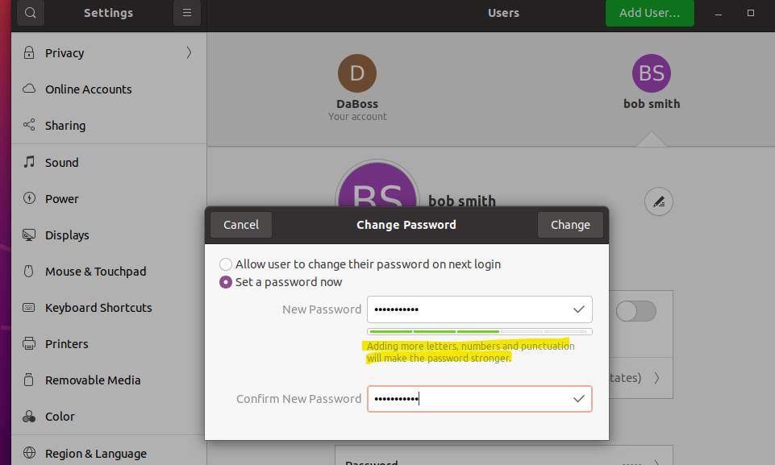

##
## Correctif 2 
## Fermer les ports non utilisés [22(ssh),80 (http)].

- Comme second correctif, on peut mettre en place des règles de parefeu qui empêche le traffic sur les ports qui sont ouverts mais que l'on ne se sert pas comme les ports 22 (SSH) et 80 (HTTP). Ce correctif aura comme effet de bloquer la deuxième étape de l'exploit donc le reste de l'exploit ne peut pas fonctionner.
- Il faut d'abord faire la commande (sudo netstat -pantu) pour voir quel port est  ouvert et quel protocol écoute sur quel port.
- Ensuite, on active le parefeu avec la commande : sudo ufw enable
- Après, on désactive le port avec la commande : sudo ufw deny 22
- Pour finir, on s'assure que le port est bien fermer avec la commande : sudo ufw status verbose.
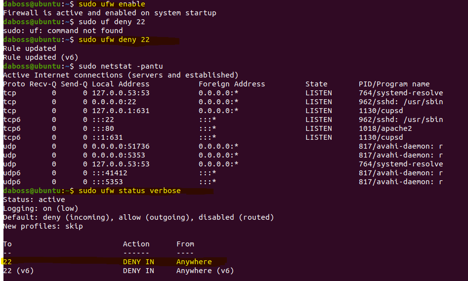

##
## Correctif 3
## Changer les permissions des fichiers de configuration du site.

- Pour le dernier correctif, il faut changer les permissions des fichiers de configurations du site et aussi du dossier ou est situé les fichiers. Ce correctif intevient dans la 4 ème étape et empêche à n'importe qui de modifier le site web.
- Première étape, utilisé la commande cd /var/www/html pour aller dans l'emplacement des fichiers de configuration du site. Ensuite, on fait la commande sudo chmod 644 /var/www/html/* pour que les autres puisse lire seulement et sudo chmod 755 /var/www/html/ pour que www.data puisse accéder au dossier et afficher le site.

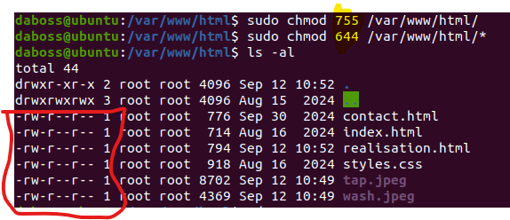
